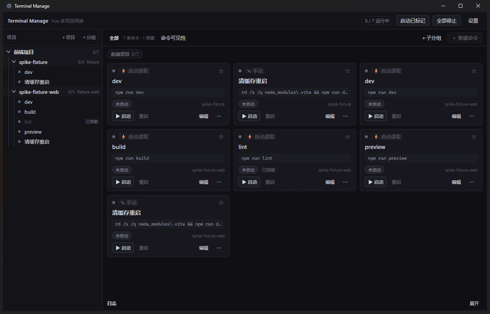
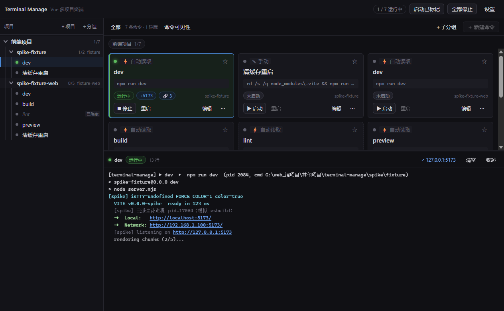
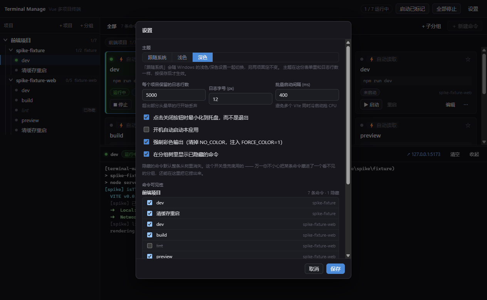

# Terminal Manage

面向 **Vue 多项目开发** 的 Windows 桌面终端管理工具。



> 截图里的项目与命令全部来自仓库自带的夹具（`spike/fixture`、`spike/fixture-web`），可以用 `spike/shot.ps1` 复现。

同时开好几个 Vue 项目时，要记住每个项目在哪个目录、跑哪条命令、开着哪几个终端窗口；重启后还得一个个重新敲。这个工具把「哪个目录 + 跑什么命令」变成一张可保存的卡片：左边是可嵌套的分组树，右边点一下就启动，日志直接显示在下面。

- 语言/栈：**TypeScript** 贯穿主进程与渲染进程 —— Electron + Vue 3 + electron-vite
- **零原生依赖**：不引入 `node-pty` / `xterm.js`，`npm install` 不需要任何 C++ 编译工具链
- 不做：TUI、SSH、多平台、插件系统、云同步（见 [docs/技术方案.md](docs/技术方案.md) §1.3）

完整设计见 [**docs/技术方案.md**](docs/技术方案.md)。

## 界面

左边是可嵌套的分组树，右边每条命令一张卡片：点「启动」就在这条命令所属的目录里跑，输出实时落到下面的日志面板，卡片上直接显示监听端口与当前日志行数。



设置里的「命令可见性」按项目分段 —— 可以逐个顶层项目、逐条命令勾选要显示的子集；隐藏只影响显示，配置本身照常保留：



> 头图与上面两张图里的项目、命令全部来自仓库自带的夹具（`spike/fixture`、`spike/fixture-web`）。后两张可以用 `node spike/readme-shots.mjs` 重新生成：它跑在 `spike/.readme-profile/` 里，**不碰你真实的 config.json**，结束时也只杀自己起的进程树。

## 环境要求

| 项目 | 要求 |
|---|---|
| 系统 | Windows 10 / 11 |
| Node.js | **≥ 22**（开发机用 v24.19.0 验证；`node --test` 跑 `.ts` 依赖内置类型擦除） |
| 包管理器 | npm（开发机用 11.17.0） |

国内网络建议先设镜像再安装：

```powershell
$env:ELECTRON_MIRROR = "https://npmmirror.com/mirrors/electron/"
$env:ELECTRON_BUILDER_BINARIES_MIRROR = "https://npmmirror.com/mirrors/electron-builder-binaries/"
npm install
```

## 常用命令

| 命令 | 作用 |
|---|---|
| `npm run dev` | 启动开发版（渲染进程在 http://localhost:5273） |
| `npm run build` | 构建到 `out/` |
| `npm run dist` | 打包成 Windows 安装包（`dist\Terminal-Manage-<版本>-setup.exe`），见下 |
| `npm run typecheck` | 主进程与渲染进程分别做类型检查 |
| `npm run test:unit` | 单元测试（`node:test` + `.ts` 直接跑，零构建） |
| `npm run test:integration` | 进程管理端到端（真的起进程、真的 taskkill） |
| `npm run test:ui` | **界面交互探针**，见下 |
| `npm test` | typecheck + 单元 + 集成 |

## 界面交互探针（`npm run test:ui`）

渲染层有一类 bug 是「必定发生但完全静默」的：异常抛在微任务里、没人捕获，界面上毫无反应，截图看不出来，主进程日志里也没有。比如 `v-for` 作用域里的 `ref="x"` 会被 Vue 编译器打上 `ref_for`，运行时 `x.value` 变成 `[el]`，`x.value?.focus()` 骗不过去 —— 输入框渲染出来了、就是没聚焦。

[spike/ui-probe.mjs](spike/ui-probe.mjs) 用 Chrome DevTools Protocol 解决这个：主进程在 `TM_DEBUG=1` 时打开 CDP 端口，探针连上去，在**真实窗口**里派发 `dblclick` / `keydown`，读回 DOM 与磁盘的实际状态。零依赖，Node 24 自带 `fetch` 与 `WebSocket`。

```powershell
npm run test:ui                 # 用仓库自带的夹具 spike/fixture 与 spike/fixture-web
node spike/ui-probe.mjs <目录>…  # 换成自己的项目目录（至少两个同级目录，见下）
```

不传目录时用的是仓库自带的两个夹具，并且**必须**有两个同级目录 —— 「移动到…」这类断言要有跨分组的目标才测得出来，只有一个分组时探针会直接报错退出。

整轮跑在一次性的 `spike/.probe-profile/` 里（通过 `TM_USER_DATA` 换掉 userData），**不会碰你真实的 config.json**。截图同理：`spike/shot.ps1` 与 `spike/readme-shots.mjs` 都支持 `TM_USER_DATA`，README 的头图出自前者、功能图出自后者。两者收尾时都只按 PID 杀自己起的进程树 —— 探针早期版本按映像名 `taskkill /IM electron.exe`，会连你正在用的实例一起干掉，已经改掉了。

## 环境变量

| 变量 | 作用 |
|---|---|
| `TM_DEBUG=1` | 把窗口生命周期与渲染进程错误写到 `<userData>/debug.log`；同时打开 CDP 端口 `9223` |
| `TM_USER_DATA=<目录>` | 换掉整个用户数据目录（隔离测试用） |
| `FORCE_COLOR` | 由应用按设置项自动设置，一般不用手动 |

启动失败时**先看 `%APPDATA%\terminal-manage\debug.log`**：里面有 `ready-to-show` 就说明窗口一定创建成功了，问题在别处。

## 配置文件

`%APPDATA%\terminal-manage\config.json` —— 只存声明式配置（分组树 + 设置），**不存进程状态**（进程句柄无法序列化）。

它是普通的 JSON，可以直接手改；改坏了应用会按默认值兜底并在界面上提示。

> 应用**不会**在启动时自动拉起任何命令。要一键启动，先点卡片右上角的 ☆ 把命令标记上，再按标题栏的「启动已标记」—— 见 [docs/技术方案.md](docs/技术方案.md) §4.4.4。

## 打包与分发

```powershell
npm run dist        # = electron-vite build && electron-builder --win
```

产物都在 `dist\`：

| 文件 | 说明 |
|---|---|
| `Terminal-Manage-0.1.1-setup.exe` | NSIS 安装包，约 106 MB |
| `win-unpacked\` | 免安装的裸目录，调试时直接跑这里的 exe 更快 |

安装是**用户级**的（`perMachine: false`）：装到 `%LOCALAPPDATA%\Programs\Terminal Manage`，不弹 UAC；卸载时**不会**删 `%APPDATA%\terminal-manage`，所以卸载重装不用重新配一遍命令树。

包**没有代码签名**，首次运行 Windows SmartScreen 会拦一下 —— 点「更多信息 → 仍要运行」。

`electron-builder.yml` 里的 `files` 只放 `out/**` 与 `package.json`，实测打出来的 `app.asar` 就是这 6 个文件。之所以敢不放 `node_modules`：`package.json` 里一个 `dependencies` 都没有（全是 devDependencies），而 `externalizeDepsPlugin()` 只外部化 `dependencies`，主进程与 preload 已经是自包含的单文件。

## 目录结构

```
src/
  shared/     主/渲染进程共享的契约：types.ts（数据模型）· channels.ts（IPC 通道）· tree.ts（树纯函数）
  main/       主进程：core/（进程管理·日志管道·读 package.json）· ipc/ · store/
  preload/    contextBridge 白名单，渲染进程唯一的对外入口
  renderer/   Vue 3 界面：components/ · store/ · utils/
docs/         技术方案 + 真机截图
spike/        验证脚本：M0 夹具 · 集成测试 · 界面探针 · 截图工具
```

## 四个必须知道的坑

1. **进程树必须整棵杀**。`npm run dev` 会派生 `cmd → node(npm) → node(vite) → esbuild`，只 kill 第一层的话 vite 还占着端口，而 Vite 检测到端口被占会自己 `+1`，几轮重启后 5174/5175 僵尸堆积、极难排查。所以统一用 `taskkill /PID <pid> /T /F`。
2. **主进程是唯一的真相源**。进程句柄只存在主进程，渲染进程通过 IPC 请求、通过事件收状态，永远不持有句柄。
3. **`\r` 是覆写不是换行**。构建进度条靠 `\r` 覆盖当前行，直接 `split('\n')` 会得到一堆挤在一起的垃圾行 —— 日志管道里有专门的 `LineBuffer` 处理。
4. **`ELECTRON_RUN_AS_NODE=1` 会让 Electron 退化成纯 Node**。某些 shell / IDE 会注入这个变量，此时 `require('electron')` 只返回一个路径字符串、`electron.app` 是 `undefined`。开发路径在 `electron.vite.config.ts` 顶部 `delete process.env.ELECTRON_RUN_AS_NODE` 兜住了，**打包版没有这层保护** —— 从这种环境里启动它会安静地退出（退出码 0、无窗口、无任何输出）。从资源管理器双击快捷方式不受影响。

更多排查记录见 [docs/技术方案.md](docs/技术方案.md) 附录 B。

## 许可证

[MIT](LICENSE) © 2026 ljcq0
